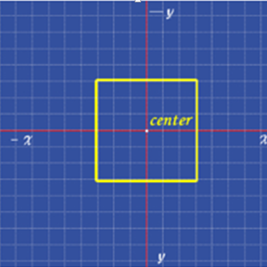
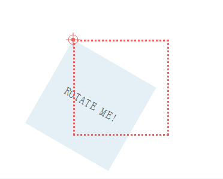

## 实现一条0.5px的边

[原文地址--掘金](https://juejin.im/post/5ab65f40f265da2384408a95)

> 偶然在掘金上看到这篇实现0.5px边的文章，觉得有意思，自己也实现下

- 方法1
> 直接设置0.5px。firfox,safari上能正常显示，chorme上显示的1px，有缺陷。eg:
```css
    div {
        height: "0.5px"
    }
```

- 方法2
> 利用transform的scale缩放方法，与transform-origin实现

```css
    div {
        height: "1px";
        transform: scaleY(.5);
        transform-origin: 50% 100%;
    }
```
> 刚开始看不懂`transform-origin`的作用，认为既然是变换位置，translate同样可以实现。然后查资料明白：`transform`的写缩放、旋转都是以图形的中心为基准的，`transform-origin`可以改变这个中心的位置，具体可以设置的属性可以自行查资料。下面放两张图，大家可以看看：

```css
div {
    transform: rotate(60deg);
    transform-origin: top left;
}

```




- 方法三
> 使用线性渐变(个人不推荐使用，感觉和scaleY(.5))效果差不多

```css
    div {
        height: 1px;
        background: linear-gradient(0deg, #fff, #000);
    }
```
- 方法4
> 方法4是用svg实现的，本人对svg不熟悉，以后再讨论
